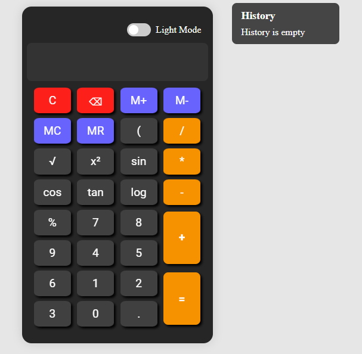

An interactive, fully responsive calculator with scientific functions, memory support, dark/light mode, and live history tracking. Built with vanilla HTML, CSS, and JavaScript.

## 🚀 Features

- ✅ **Dark / Light Mode** toggle
- ✅ **Scientific Operations**: `√`, `x²`, `sin`, `cos`, `tan`, `log`
- ✅ **Memory Functions**: `M+`, `M-`, `MC`, `MR`
- ✅ **Calculation History** panel
- ✅ **Responsive Layout** with mobile-first design
- ✅ **Styled UI with clear color-coding**

## 🛠️ Technologies

- HTML (70+ lines)
- CSS (350+ lines)
- JavaScript (190+ lines)

## 🌐 Live Demo

[🔗 Click here to try it live](https://askdanish144.github.io/multi-function-scientific-calculator-ui/)

## 📁 How to Use

1. Clone the repo:
   git clone https://github.com/askdanish144/multi-function-scientific-calculator-ui.git
